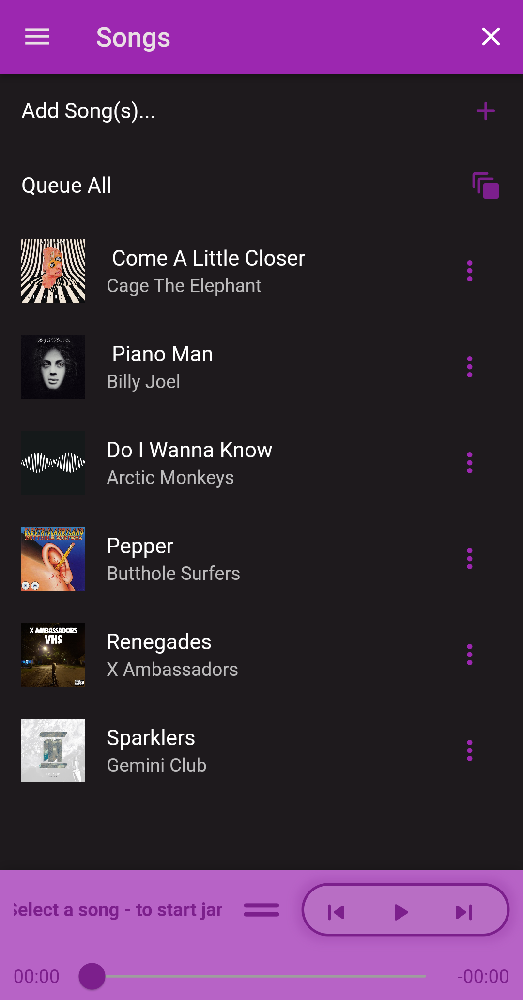
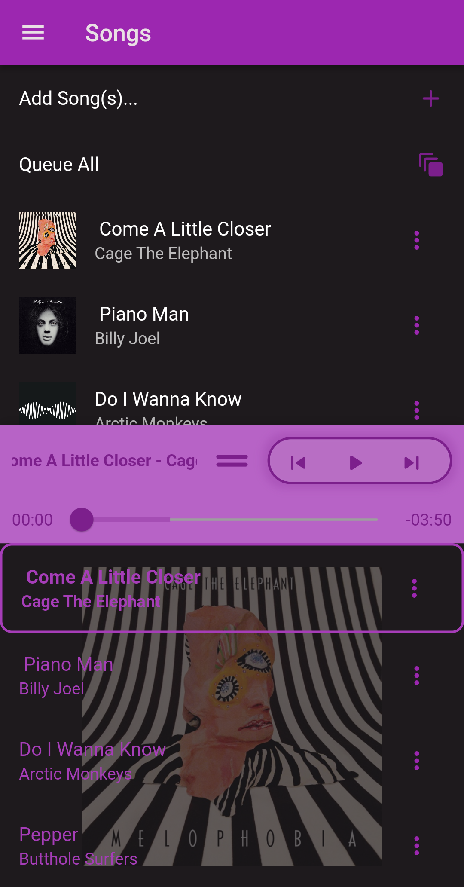
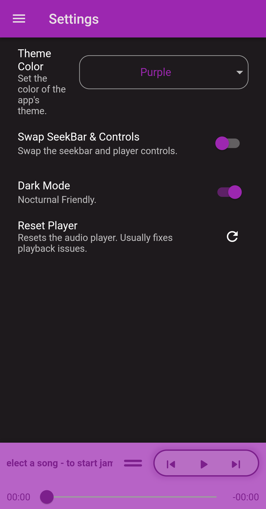
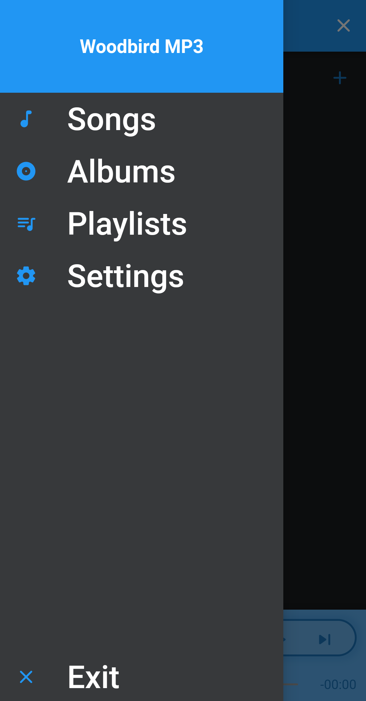
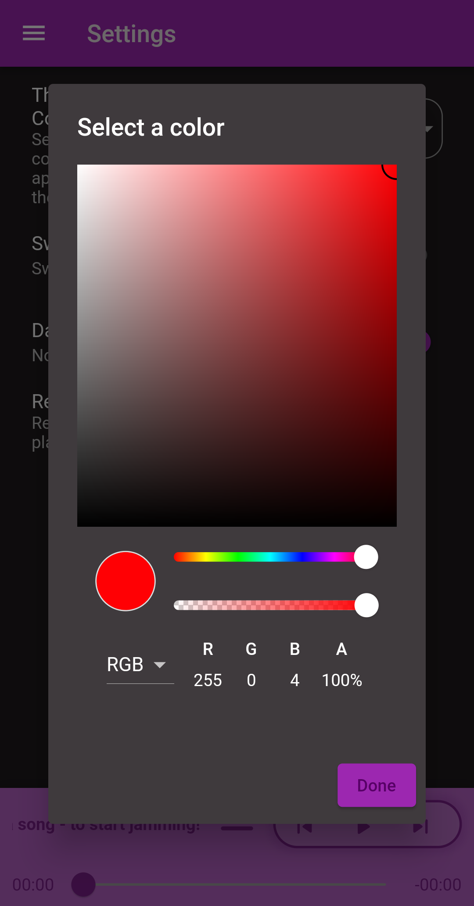
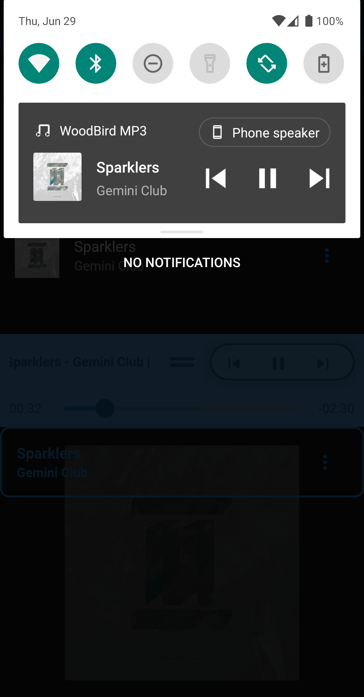

# 🐦 WoodBird MP3 🕊

  
   
  
   
  
  

WoodBird MP3 is a free open-source music player made with Flutter 🕊. This app allows you to play downloaded music without ads and without internet. Great for car trips, flights, camping, and other times when you need low battery usage and no internet. Works with bluetooth devices and media buttons.

- Available on Android.
- Mac and iOS are untested.
- Windows is unsupported until `just_audio_windows` allows file playback.
